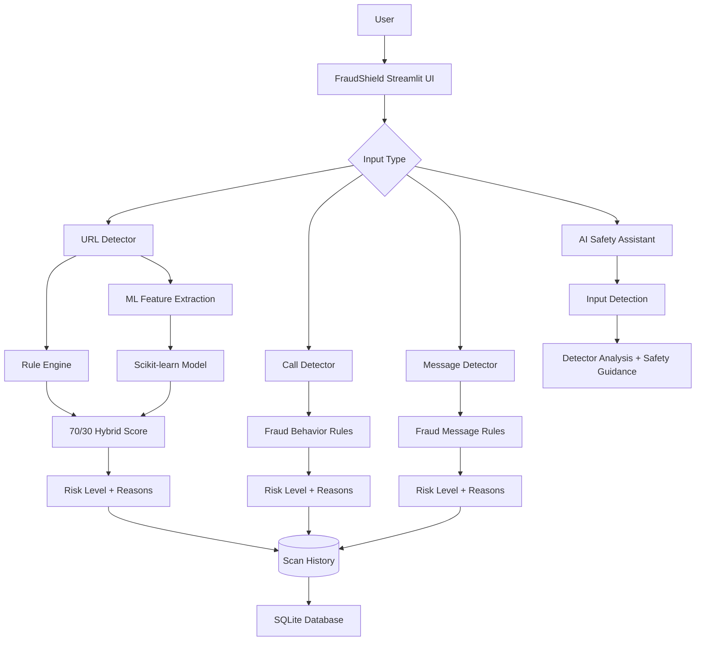

# 🛡️ FraudShield AI

> **An AI-assisted fraud detection platform for identifying suspicious URLs, scam messages, and high-risk phone calls.**

[](https://fraudshield-ai-hk.streamlit.app/)
[](https://www.python.org/)
[](https://streamlit.io/)
[](https://scikit-learn.org/)

## 🚀 Live Demo

### 👉 [Open FraudShield AI](https://fraudshield-ai-hk.streamlit.app/)

FraudShield is deployed as a public Streamlit application and can be used directly from a browser.

---

## 🎯 Problem

Online fraud can appear through phishing URLs, scam messages, impersonation calls, fake rewards, urgent payment requests, and other social-engineering patterns.

**FraudShield AI** provides a single interface for checking several common fraud channels and explaining the warning signals detected.

---

## ✨ Key Features

| Feature | What it does |
|---|---|
| 🔗 **URL Detector** | Analyzes suspicious URLs using rule-based indicators and an ML model |
| 📞 **Call Detector** | Scores calls based on OTP requests, banking details, payments, threats, and impersonation signals |
| 💬 **Message Detector** | Checks SMS/email/chat text for urgency, OTP, payment, suspicious-link, reward, and other fraud patterns |
| 🎙️ **AI Assistant** | Lets users describe a suspicious link, call, or message and receive safety guidance |
| 📋 **Scan History** | Stores and displays previous scan results |
| 🧠 **Hybrid Detection** | Combines deterministic security rules with ML risk scoring for URL analysis |
| 🌈 **Cyber-Security UI** | Neon, high-contrast interface designed around a fraud-alert theme |

---

## 🧠 How URL Detection Works

FraudShield's URL detector uses a **defense-in-depth** approach:

1. **Rule Engine** checks structural and behavioral signals such as suspicious words, suspicious TLDs, URL shorteners, IP-based hosts, lookalike domains, encoded characters, unusual URL structure, and known threat/safe domains.
2. **ML Model** extracts URL features and predicts whether the URL is phishing-like or legitimate.
3. **Combined Risk Score** uses the existing application weighting:
   - **70% Rule Engine**
   - **30% ML Risk Score**
4. **Protection Layer** prevents strong rule-based security signals from being downgraded by the ML result.

The final result is presented as:

**🟢 LOW RISK → 🟡 MEDIUM RISK → 🔴 HIGH RISK**

---

## 🏗️ System Architecture



---

## 🛠️ Tech Stack

**Languages & Framework**
- Python
- Streamlit

**Machine Learning**
- Scikit-learn
- Random Forest model
- Joblib model serialization

**Data & Visualization**
- SQLite
- Plotly

**Detection**
- URL feature extraction
- Rule-based fraud scoring
- Threat/safe domain lists
- Call and message pattern analysis

---

## 📂 Project Structure

```text
FraudShield-AI/
│
├── app.py
├── database.py
├── requirements.txt
├── safe_domains.txt
├── threat_domains.txt
│
├── modules/
│   ├── __init__.py
│   ├── url_detector.py
│   ├── call_detector.py
│   ├── message_detector.py
│   └── chatbot.py
│
├── ml/
│   ├── dataset.csv
│   ├── model.pkl
│   └── train_model.py
│
└── .streamlit/
    └── config.toml
```

---

## ▶️ Run Locally

Clone the repository:

```bash
git clone https://github.com/HARSHADK-2332/FraudShield-AI.git
cd FraudShield-AI
```

Install dependencies:

```bash
pip install -r requirements.txt
```

Run the application:

```bash
streamlit run app.py
```

---

## 🔐 Safety & Privacy Notes

- Never enter real OTPs, passwords, PINs, CVVs, banking credentials, or other sensitive information into the app.
- Detection results are **risk indicators**, not a guarantee that a URL, call, or message is safe.
- The current history implementation uses local SQLite storage; cloud persistence may require an external database for a production-scale deployment.

---

## 📌 Resume-Ready Project Description

**FraudShield AI — AI-Assisted Fraud Detection Platform**

Built and deployed a Streamlit-based fraud detection platform that analyzes suspicious URLs, scam calls, and fraudulent messages. Implemented a hybrid URL detection pipeline combining rule-based security heuristics with a Random Forest ML model using a 70:30 weighted risk score, added explainable risk indicators and scan history, and deployed the application publicly on Streamlit Community Cloud.

---

## 👨‍💻 Developer

**HARSHADK-2332**

🔗 [GitHub Repository](https://github.com/HARSHADK-2332/FraudShield-AI)  
🚀 [Live Application](https://fraudshield-ai-hk.streamlit.app/)

---

## ⚠️ Disclaimer

FraudShield AI is a student/developer security project intended to assist users in identifying common fraud indicators. It should not be considered a complete security product or a substitute for official verification.
